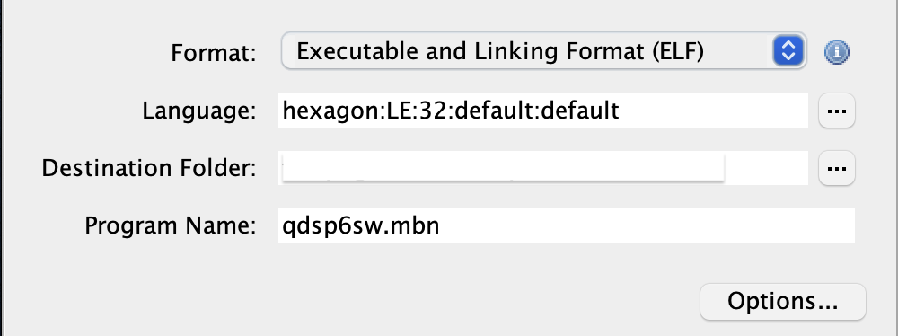

# Reverse Engineering using Ghidra

## Setting up Ghidra
1. Clone the `ghidra-plugin-hexagon`
```bash
git clone https://github.com/CUB3D/ghidra-plugin-hexagon-updated.git
```
2. Install [gradle](https://gradle.org/install/)
3. Fetch dependencies
```bash
cd ghidra-plugin-hexagon
gradle --init-script gradle/support/fetchDependencies.gradle
```
4. Build ghidra
```bash
gradle buildGhidra -x ip -x createJavadocs -x createJsondocs -x zipJavadocs -x buildDecompilerDocumentationPdfs
```
5. Unzip the ghidra
```bash
cd build/dist
unzip ghidra_*.zip
```
6. Run ghidra
```bash
./ghidra_*_DEV/ghidraRun
```
7. Create a new project in Ghidra
8. Import the hexagon firmware file `qdsp6sw.mbn` 


## Update memory map in Ghidra
1. Emulate the hexagon firmware using [`qemu-system-hexagon`](emulation.md#debugging-with-qemu-system-hexagon)
2. Get memory mapping information
```bash
./qemu-system-hexagon -kernel qdsp6sw.mbn  -monitor stdio -s
(qemu) info mtree
```
3. Compare the output from above with what ghidra has after importing the firmware file and update the memory map (Window -> Memory Map) in ghidra if necessary. 

## Coloring the qemu trace in Ghidra
It is helpful to see in ghidra which functions are called when the firmware is executed in QEMU. The following scripts can be used by importing them in ghidra to color the functions covered in the qemu trace.
1. Capture the trace from the emulation
```bash
./qemu-system-hexagon -kernel qdsp6sw.mbn -monitor stdio -gdb tcp::1340 -d exec 2>trace.txt
```
2. Use the script [ghidra_colorize_qemu_trace.py](../scripts/ghidra_colorize_qemu_trace.py) with the trace output from above step.
    -  Put the colorize script in the `ghidra_scripts` directory
    - Or, create a new script (Window -> Script Manager -> New Script)
The script [ghidra_colorize_qemu_trace_per_thread.py](../scripts/ghidra_colorize_qemu_trace_per_thread.py) puts different color for each thread execution.

## Debugging ghidra function
A good place to start with understanding the firmware, is to check the `Defined Strings` in Ghidra. We can select a promising string such as `QURT root task started` and see which functions are using this string. From there on, we can start to understand the functionality of the function. 
